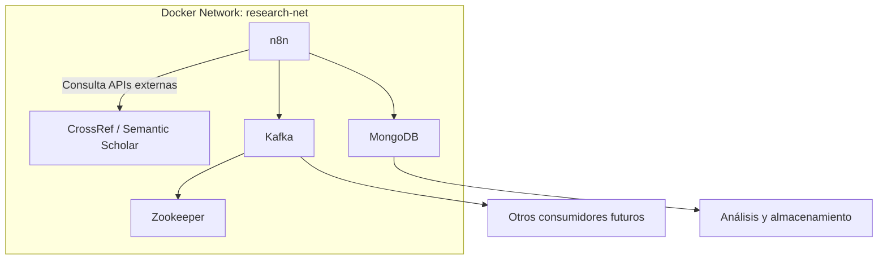

# 🧠 Research AI Assistant

**Research AI Assistant** es una automatización inteligente desarrollada con **n8n** que busca, analiza y puntúa artículos científicos de investigación en el campo de la **Inteligencia Artificial** u otros.  
El sistema integra múltiples APIs, bases de datos y servicios distribuidos bajo una arquitectura contenida totalmente en **Docker**, garantizando portabilidad, escalabilidad y seguridad.

---

## 🚀 Tecnologías utilizadas

- **n8n** → Motor principal de automatización de flujos (no-code/low-code)
- **MongoDB** → Almacenamiento de artículos y resultados analíticos
- **Apache Kafka** → Comunicación asíncrona entre procesos
- **Docker** → Orquestación de contenedores
- **Docker Compose** → Gestión de servicios multi-contenedor
- **JavaScript / JSON** → Estructura de automatización
- **APIs externas** → Fuentes de datos académicos (CrossRef, Semantic Scholar, etc.)

---

## 📁 Estructura del repositorio

```
research-ai-assistant/
│
├── n8n_workflow.json        # Automatización exportada desde n8n
├── docker-compose.yml        # Configuración de servicios
├── README.md                 # Este archivo
└── .env                      # Variables de entorno (no subir credenciales)
```

---

## ⚙️ Instalación y configuración

### 1️⃣ Clonar el repositorio

```bash
git clone https://github.com/tu-usuario/research-ai-assistant.git
cd research-ai-assistant
```

---

### 2️⃣ Crear una red Docker para los servicios

Esto permitirá que **n8n**, **MongoDB** y **Kafka** se comuniquen entre sí:

```bash
docker network create research-net
```

---

### 3️⃣ Configurar MongoDB en Docker

```bash
docker run -d   --name mongodb   --network research-net   -p 27017:27017   -v mongo_data:/data/db   mongo:latest
```

✅ **Verifica:**  
Abre un cliente MongoDB o usa `mongosh`:

```bash
docker exec -it mongodb mongosh
```

---

### 4️⃣ Configurar Kafka y Zookeeper en Docker

Kafka necesita un servicio de **Zookeeper**, así que lo levantamos junto con él:

```bash
# Levantar Zookeeper
docker run -d   --name zookeeper   --network research-net   -p 2181:2181   zookeeper:3.8

# Levantar Kafka
docker run -d   --name kafka   --network research-net   -p 9092:9092   -e KAFKA_ZOOKEEPER_CONNECT=zookeeper:2181   -e KAFKA_ADVERTISED_LISTENERS=PLAINTEXT://kafka:9092   -e KAFKA_LISTENERS=PLAINTEXT://0.0.0.0:9092   wurstmeister/kafka:2.13-2.8.0
```

✅ **Verifica:**  
Kafka está activo si ejecutas:

```bash
docker logs kafka
```

y ves algo como `started (kafka.server.KafkaServer)`.

---

### 5️⃣ Instalar y levantar n8n en Docker

```bash
docker run -d   --name n8n   --network research-net   -p 5678:5678   -v ~/.n8n:/home/node/.n8n   n8nio/n8n:latest
```

Una vez que el contenedor esté corriendo, abre en tu navegador:

👉 http://localhost:5678  

Allí podrás importar tu flujo (`n8n_workflow.json`).

---

## 🔄 Importar tu automatización en n8n

1. Ingresa a **n8n** en `http://localhost:5678`
2. Clic en **Import > Import from file**
3. Selecciona el archivo `n8n_workflow.json`
4. Guarda los nodos y revisa las conexiones a MongoDB y Kafka
5. Presiona **Execute Workflow** para probar el sistema

---

## 📡 Variables de entorno recomendadas

Crea un archivo `.env` (no lo subas a GitHub) con tus valores locales:

```bash
MONGO_URI=mongodb://mongodb:27017/research_ai
KAFKA_BROKER=kafka:9092
N8N_ENCRYPTION_KEY=clave-segura-aqui
```

---

## 🧩 Conexión entre servicios

Todos los servicios se comunican dentro de la misma red de Docker (`research-net`):

| Servicio  | Host interno | Puerto | Función principal            |
|------------|--------------|--------|------------------------------|
| MongoDB    | `mongodb`    | 27017  | Base de datos                |
| Kafka      | `kafka`      | 9092   | Mensajería asíncrona         |
| Zookeeper  | `zookeeper`  | 2181   | Coordinador de Kafka         |
| n8n        | `n8n`        | 5678   | Motor de flujos de automatización |

---

## 🧠 Descripción del flujo (Workflow n8n)

El flujo del proyecto **Research AI Assistant** realiza las siguientes tareas:

1. **Búsqueda de artículos científicos** → Consulta APIs académicas.  
2. **Evaluación de relevancia** → Analiza el contexto, resumen y palabras clave.  
3. **Puntuación automática** → Genera un score de prioridad (0–100).  
4. **Almacenamiento** → Guarda resultados en MongoDB.  
5. **Publicación asíncrona** → Envía mensajes a Kafka para otros procesos analíticos.

---

## 📊 Ejecución completa con Docker Compose (opcional)

Si prefieres levantar todo con un solo comando, crea un `docker-compose.yml` así:

```yaml
version: '3.8'
services:
  mongodb:
    image: mongo:latest
    container_name: mongodb
    networks:
      - research-net
    ports:
      - "27017:27017"
    volumes:
      - mongo_data:/data/db

  zookeeper:
    image: zookeeper:3.8
    container_name: zookeeper
    networks:
      - research-net
    ports:
      - "2181:2181"

  kafka:
    image: wurstmeister/kafka:2.13-2.8.0
    container_name: kafka
    networks:
      - research-net
    ports:
      - "9092:9092"
    environment:
      KAFKA_ZOOKEEPER_CONNECT: zookeeper:2181
      KAFKA_ADVERTISED_LISTENERS: PLAINTEXT://kafka:9092
      KAFKA_LISTENERS: PLAINTEXT://0.0.0.0:9092

  n8n:
    image: n8nio/n8n:latest
    container_name: n8n
    networks:
      - research-net
    ports:
      - "5678:5678"
    volumes:
      - ~/.n8n:/home/node/.n8n

networks:
  research-net:

volumes:
  mongo_data:
```

Ejecuta:

```bash
docker-compose up -d
```

y listo 🎯

---

## 🧩 Diagrama de arquitectura



---

## 🧑‍💻 Autor

**Jeferson Apaza**  
Desarrollador Backend & Data Science Student  
📍 Perú 🇵🇪  
📧 [LinkedIn](https://www.linkedin.com/in/jefersonapaza)

---

## 🧾 Licencia

Este proyecto se distribuye bajo la licencia **MIT**, lo que permite su uso, copia, modificación y distribución con atribución al autor original.

---

> “Automatizar la búsqueda del conocimiento es el primer paso hacia una IA verdaderamente científica.”  
> — *Jeferson Apaza*
